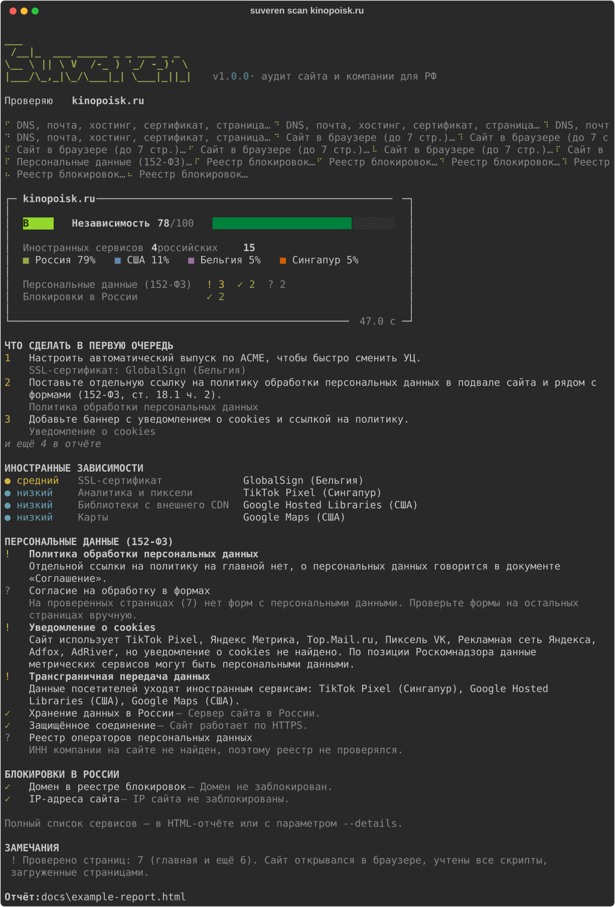
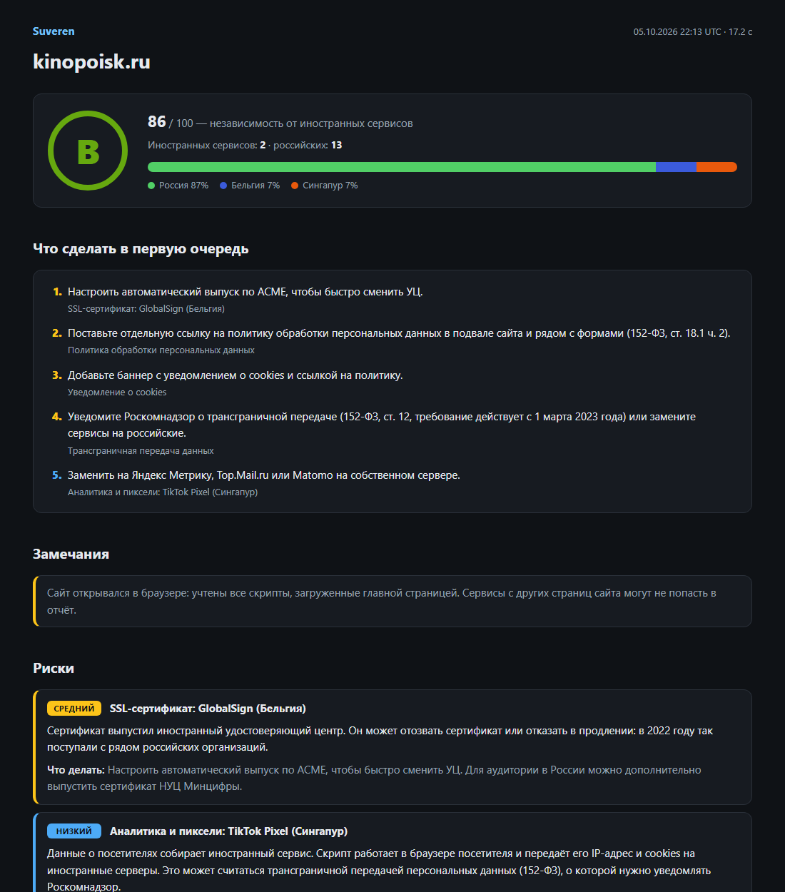
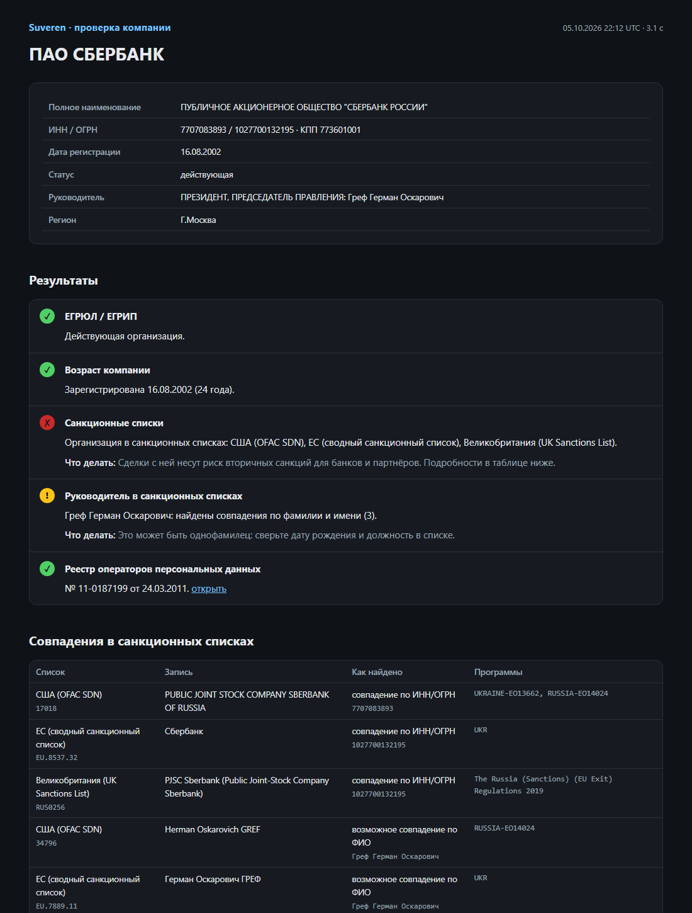

<div align="center">

# Suveren

**Website and company audit for doing business in Russia: foreign dependencies, personal-data law, blocking, company registry and sanctions.**

[](https://github.com/marsilid/suveren/actions/workflows/ci.yml)


[Русская версия](README.md)

</div>

Suveren answers three questions:

1. **What breaks if foreign providers cut you off?** It finds everything running on
   infrastructure outside Russia (DNS, mail, hosting, CDN, site builder, registrar, TLS
   certificate, page scripts and widgets), explains the risk, suggests a Russian alternative and
   grades independence from **A** to **F**.
2. **Does the site comply with Federal Law 152-FZ and is it reachable from Russia?** Privacy
   policy, consent in forms, cookie notice, cross-border transfer, data localisation, the
   Roskomnadzor register of personal-data operators and the Roskomnadzor block list.
3. **Who is behind it?** Company data from the Russian state register (EGRUL) and screening of
   the company and its head against the US (OFAC SDN), EU and UK sanctions lists.

The tool targets Russian businesses, so its interface and reports are in Russian.



## Install and run

```bash
pip install "suveren[browser] @ git+https://github.com/marsilid/suveren.git"

suveren scan example.ru --browser    # full check, page rendered in Edge/Chrome
suveren scan example.ru --quick      # foreign dependencies only (handy in CI)
suveren batch sites.txt              # many sites: index.html, CSV, a report per site
suveren company 7707083893           # company by tax ID (INN), OGRN or domain
suveren diff before.json after.json
suveren update                       # refresh sanctions and block lists
```

On Windows you can also run `Suveren.bat`, which installs everything on first launch. A
`Dockerfile` is included.





## How it works

- A service's country is the jurisdiction of the company that runs it: sanctions apply to
  companies, not data centres. The database has 180+ foreign and Russian services.
- Each category with a foreign dependency yields one finding: high −20, medium −10, low −4.
  A ≥ 90, B ≥ 75, C ≥ 60, D ≥ 40, otherwise F. A Russian server next to a foreign one in the
  same category lowers the risk one step.
- `--browser` renders the home page with Playwright in the installed Edge or Chrome and counts
  every network request, so tag-manager-injected scripts are found too. Anti-bot stubs and empty
  JavaScript shells are detected and reported as "not verified" rather than as failures.
- Sanctions matching by INN/OGRN is exact. Name matching is transliteration-aware
  ("СБЕРБАНК РОССИИ" = "Sberbank of Russia"). Matches on a person's name are flagged as possible,
  because namesakes exist.
- All sources are public and free: Team Cymru IP-to-ASN, RDAP/WHOIS, egrul.nalog.ru,
  pd.rkn.gov.ru, the Roskomnadzor register dump from antifilter.download, and the official OFAC,
  EU and UK lists. Lists are cached for a day.

## Limitations

Only the home page (plus the policy and contacts pages it links to) is analysed; some sites block
even the browser mode; a site behind a CDN hides its real hosting; name-based sanctions matches
need human review. The scan is passive. The report is a triage aid, **not legal advice**.

## Contributing

Services live in [`src/suveren/services.py`](src/suveren/services.py): add a `Service(...)`
entry, add a test to `tests/test_services.py`, and open a pull request. Tests run offline.

## License

[MIT](LICENSE)
