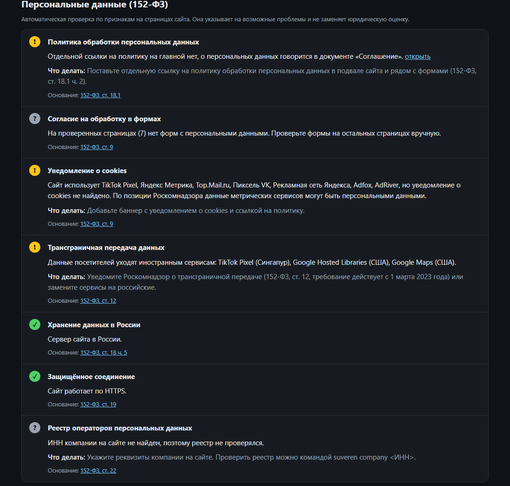
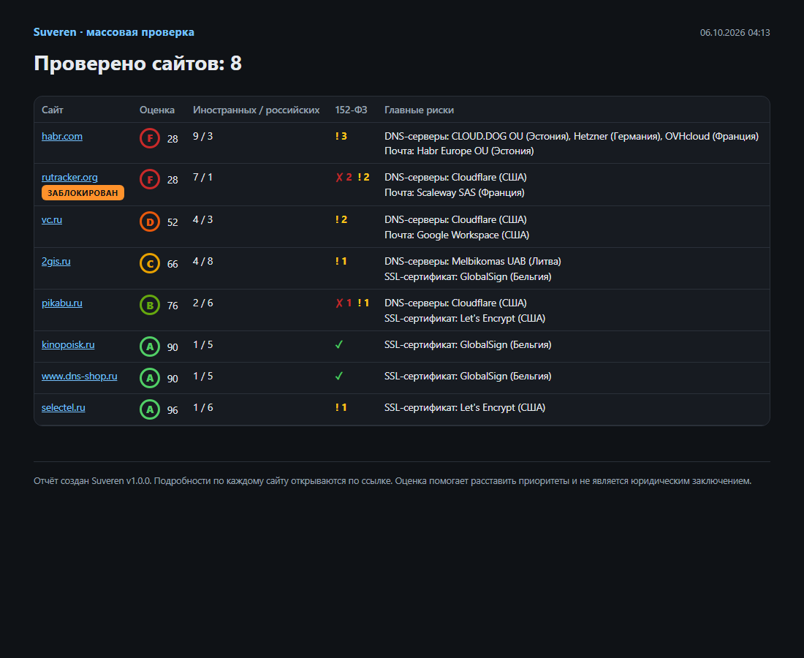

<div align="center">

# Suveren

**Аудит сайта и компании для работы в России: иностранные сервисы, 152-ФЗ, блокировки, ЕГРЮЛ и санкции.**

[](https://github.com/marsilid/suveren/actions/workflows/ci.yml)


[English version](README.en.md)

</div>

Suveren отвечает на три вопроса:

1. **Что отвалится при следующей волне санкций?** Находит всё, что держится на иностранной
   инфраструктуре: DNS, почту, хостинг, CDN, конструктор сайта, регистратора, SSL-сертификат,
   скрипты и виджеты. Объясняет риск, предлагает российскую замену и ставит оценку
   независимости от **A** до **F**.
2. **Соблюдает ли сайт 152-ФЗ и открывается ли он в России?** Политика конфиденциальности,
   согласия в формах, cookies, трансграничная передача, локализация данных, реестр операторов
   ПДн, реестр блокировок Роскомнадзора.
3. **С кем мы имеем дело?** Данные компании из ЕГРЮЛ, проверка компании и её руководителя по
   санкционным спискам США, ЕС и Великобритании.

Кому пригодится: владельцам бизнеса и ИТ-директорам, веб-студиям для аудита сайтов клиентов,
юристам и ответственным за персональные данные, отделам закупок для проверки контрагентов.


## Быстрый старт

**Windows, без установки.** Скачайте `Suveren.exe` со страницы
[Releases](https://github.com/marsilid/suveren/releases) и запустите двойным кликом: откроется
меню. Python не нужен. Windows может предупредить о неизвестном издателе: нажмите «Подробнее» →
«Выполнить в любом случае». Exe собирается автоматически из этого кода на GitHub Actions.

**Любая система:**

```bash
pip install "suveren[browser] @ git+https://github.com/marsilid/suveren.git"
suveren scan example.ru --browser
```

**Docker:**

```bash
docker build -t suveren https://github.com/marsilid/suveren.git
docker run --rm -v "$PWD:/work" suveren scan example.ru
```

## Команды

| Команда | Что делает |
|---|---|
| `suveren scan <домен>` | полная проверка сайта: иностранные сервисы и оценка, 152-ФЗ, блокировки |
| `suveren scan <домен> --browser` | то же, но сайт открывается в браузере: точнее, видит динамические скрипты |
| `suveren batch sites.txt` | проверка списка сайтов: сводная таблица, CSV и отчёт по каждому сайту |
| `suveren company <ИНН, ОГРН или домен>` | ЕГРЮЛ, санкционные списки, реестр операторов ПДн |
| `suveren diff old.json new.json` | что изменилось между двумя проверками |
| `suveren services [фильтр]` | база распознаваемых сервисов |
| `suveren update` | скачать свежие санкционные списки и реестр блокировок |
| `suveren doctor` | проверить, что все источники данных доступны |
| `suveren unknown` | внешние домены, которых нет в базе: что добавить в первую очередь |
| `suveren menu` | меню для работы без командной строки (то же, что двойной клик по exe) |

Полезные параметры `scan`: `--pages N` (сколько внутренних страниц проверить, по умолчанию 6),
`--details` (все найденные сервисы в терминале), `--quick` (только иностранные сервисы), `--json file.json` (сохранить для `diff`), `--fail-under C` (код выхода 3
для CI), `--no-open` (не открывать браузер).

Отчёты сохраняются в `reports/` в HTML и открываются в браузере.

## 1. Иностранные зависимости


| Что | Как определяется | Чем грозит |
|---|---|---|
| DNS-серверы | NS-записи и сеть их IP-адресов | блокировка аккаунта кладёт сайт и почту сразу |
| Почта | MX-записи | потеря входящих писем и архива переписки |
| Хостинг | IP сайта → сеть (ASN) и страна её владельца | удаление аккаунта вместе с данными |
| Конструктор / CMS | код страницы и сеть | Tilda, Wix, Webflow, Shopify: перенести сайт непросто |
| CDN и анти-DDoS | IP сайта | недоступность и замедление для пользователей из РФ |
| Регистратор | RDAP / WHOIS | отказ в продлении домена |
| Доменная зона | TLD | санкционные требования иностранного реестра |
| SSL-сертификат | TLS-рукопожатие | отзыв сертификата иностранным УЦ |
| Скрипты и виджеты | код главной и внутренних страниц, в режиме `--browser` все сетевые запросы | аналитика, реклама, капча, шрифты, чаты, формы, карты, видео, оплата, вход через соцсети |

Отдельно отмечаются сервисы, которые в России заблокированы или не работают: Meta (Facebook,
Instagram), LinkedIn, X (Twitter), YouTube, Google Ads, а также скомпрометированный polyfill.io.

В базе **180+ сервисов**, иностранных и российских (`suveren services`). Страной сервиса
считается юрисдикция компании-владельца, а не место дата-центра: санкции применяются к компании.

**Оценка.** Каждая категория с иностранной зависимостью даёт один риск: высокий −20, средний −10,
низкий −4. A от 90, B от 75, C от 60, D от 40, ниже — F. Если в категории есть и иностранный,
и российский сервер (например, резервный NS), риск понижается на ступень.

## 2. Персональные данные и блокировки

Проверяются главная и внутренние страницы: формы чаще всего стоят в «Контактах», корзине и
оформлении заказа, поэтому они проверяются в первую очередь. Одинаковая форма из шапки сайта
считается один раз, а в отчёте видно, на какой странице найдена проблема.



| Проверка | Что смотрится |
|---|---|
| Политика обработки ПДн | ссылка на главной (ст. 18.1), основные разделы в тексте; если ссылки нет — раздел о ПДн в пользовательском соглашении |
| Согласие в формах | формы с телефоном, почтой или именем без согласия; заранее отмеченные галочки |
| Уведомление о cookies | есть ли баннер, если на сайте аналитика, реклама или чаты |
| Трансграничная передача | иностранные скрипты, получающие данные посетителей (ст. 12) |
| Хранение данных в России | где сервер сайта, если на нём собираются данные (ст. 18 ч. 5) |
| Защищённое соединение | HTTPS и адреса отправки форм |
| Реестр операторов ПДн | ИНН ищется на сайте и странице контактов, затем — в реестре Роскомнадзора |
| Реестр блокировок | домен и IP сайта в выгрузке реестра РКН |

Крупные сайты часто отдают роботам пустую страницу или проверку «вы не робот». Suveren это
распознаёт и честно пишет «не проверено» вместо ложной ошибки, а режим `--browser` в большинстве
таких случаев получает настоящую страницу.

## 3. Проверка компании

```bash
suveren company 7707083893      # по ИНН
suveren company 1027700132195   # по ОГРН
suveren company example.ru      # ИНН будет найден на сайте
```


- **ЕГРЮЛ / ЕГРИП** (ФНС): название, статус, дата регистрации, руководитель. Ликвидированная или
  слишком молодая компания отмечается.
- **Санкционные списки** США (OFAC SDN), ЕС и Великобритании. Совпадение по ИНН/ОГРН точное;
  совпадение по названию учитывает транслитерацию («СБЕРБАНК РОССИИ» = «Sberbank of Russia»).
  Руководитель проверяется по фамилии и имени, такие совпадения помечаются как возможные.
- **Реестр операторов ПДн** Роскомнадзора.
- **Сверка с сайтом**: указан ли ИНН на сайте и совпадает ли владелец домена в WHOIS.

Списки (около 110 МБ) скачиваются при первой проверке и обновляются раз в сутки. Кэш хранится в
`%LOCALAPPDATA%\suveren\cache` на Windows и в `~/.cache/suveren` на Linux и macOS.

## Массовая проверка

Для веб-студий и аудита нескольких сайтов: файл со списком, по одному домену в строке.

```bash
suveren batch sites.txt --browser
```



В папке `reports/batch-…` появятся `index.html` со сводной таблицей, `summary.csv` для Excel и
отчёт по каждому сайту.

## Отслеживание импортозамещения

```bash
suveren scan example.ru --json before.json
# ... переехали на российские сервисы ...
suveren scan example.ru --json after.json
suveren diff before.json after.json
```

```text
example.ru: независимость D → A, 52 → 96 из 100

  − убран    DNS-серверы: Cloudflare
  − убран    Почта: Google Workspace
  + добавлен DNS-серверы: Selectel
  + добавлен Почта: Яндекс 360
  ✓ Уведомление о cookies: warn → ok
```

Для CI: `suveren scan example.ru --quick --fail-under C` завершится с кодом 3, если оценка хуже C.

## Режим `--browser`

Обычная проверка читает HTML главной страницы. Современные сайты часто собирают страницу
скриптами, а аналитику подключают через менеджеры тегов, и в исходном HTML этого не видно.
С `--browser` Suveren открывает сайт в настоящем браузере (Edge или Chrome, которые уже стоят
в системе) и учитывает все сетевые запросы страницы.

Нужен пакет Playwright: `pip install playwright` (уже входит в `suveren[browser]` и ставится
`Suveren.bat`). Если в системе нет ни Edge, ни Chrome: `playwright install chromium`.

## Источники данных

| Данные | Источник |
|---|---|
| Сети и страны IP-адресов | Team Cymru IP-to-ASN (через DNS) |
| Регистратор | RDAP, WHOIS реестров |
| ЕГРЮЛ / ЕГРИП | egrul.nalog.ru (ФНС России) |
| Операторы ПДн | pd.rkn.gov.ru (Роскомнадзор) |
| Реестр блокировок | выгрузка реестра РКН от antifilter.download |
| Санкции | OFAC SDN (США), сводный список ЕС, UK Sanctions List |

Все источники открытые и бесплатные, ключи API не нужны. Государственные сайты иногда меняются без
предупреждения, поэтому `suveren doctor` проверяет каждый источник, а на GitHub эта проверка
запускается ежедневно.

## Ограничения

- Кроме главной проверяются до 6 внутренних страниц (`--pages`): в первую очередь «Контакты»,
  заявки, корзина, доставка, услуги. Сервисы, которые есть только на остальных страницах, могут
  не попасть в отчёт.
- Часть сайтов блокирует даже браузерный режим: тогда проверки по коду страницы помечаются
  как «не проверено».
- Если сайт за CDN, настоящий хостинг скрыт, и Suveren об этом предупреждает.
- Совпадения по названию и ФИО в санкционных списках нужно проверять вручную.
- Проверка пассивная: публичные DNS-записи, WHOIS, открытые реестры и обычная загрузка страниц.
  Никакого сканирования портов и подбора.
- Отчёт помогает расставить приоритеты и **не является юридическим заключением**. У каждой
  проверки 152-ФЗ указано основание (статья закона) со ссылкой на текст, чтобы вывод можно было
  перепроверить.

## Как добавить сервис в базу

База находится в [`src/suveren/services.py`](src/suveren/services.py):

```python
Service(
    "Hetzner",               # название
    "DE",                    # страна компании (ISO 3166)
    ns=("hetzner.com",),     # суффиксы NS-серверов
    mx=("your-server.de",),  # суффиксы MX-серверов
    asn=(24940,),            # номера автономных систем
    as_names=("hetzner",),   # или фрагменты названия сети
)
```

Для сервисов, подключаемых на странице, задаются категория и регулярные выражения:

```python
Service("Яндекс Метрика", "RU", c.ANALYTICS, page=(r"mc\.yandex\.(?:ru|com)",)),
```

Добавьте тест в `tests/test_services.py` и откройте pull request. Если не хотите писать код, откройте issue
«Добавить сервис»: там простая форма. Подсказка, что добавлять: `suveren unknown` показывает
домены, которые встречались при проверках, но которых нет в базе (список хранится только на
вашем компьютере).

## Разработка

```bash
pip install -e ".[dev,browser]"
pytest
ruff check . && ruff format --check .
```

Тесты не ходят в сеть: ответы реестров и фрагменты санкционных списков лежат в `tests/fixtures`.

## Связанные проекты

[ReconLens](https://github.com/marsilid/reconlens) — пассивная OSINT-разведка домена с оценкой
безопасности.

## Лицензия

[MIT](LICENSE)
